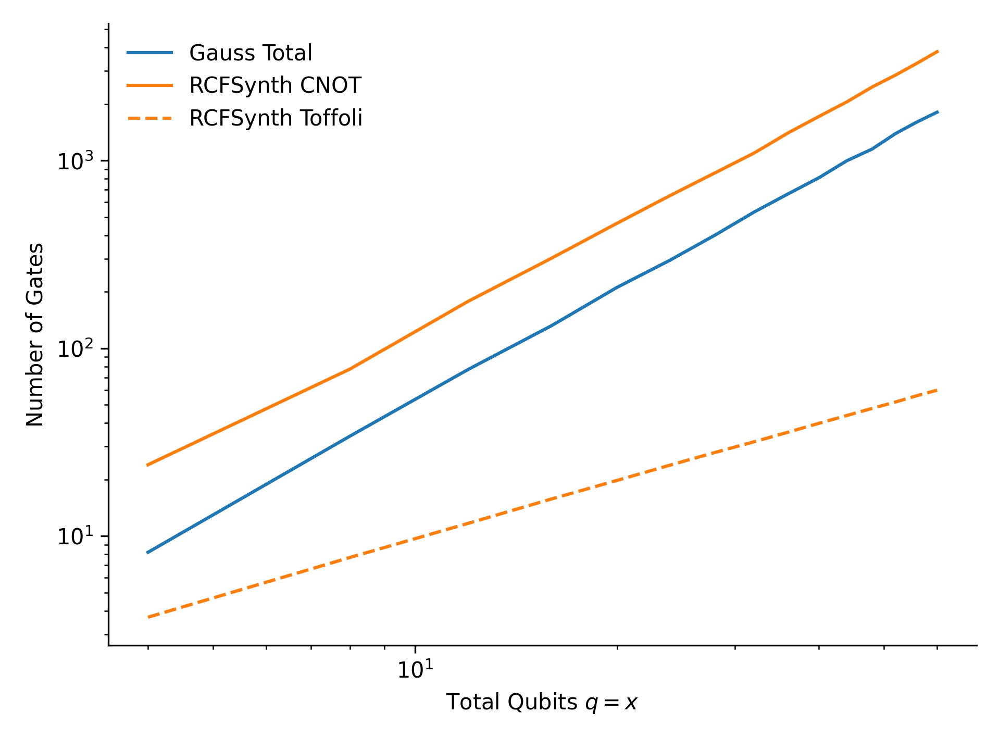
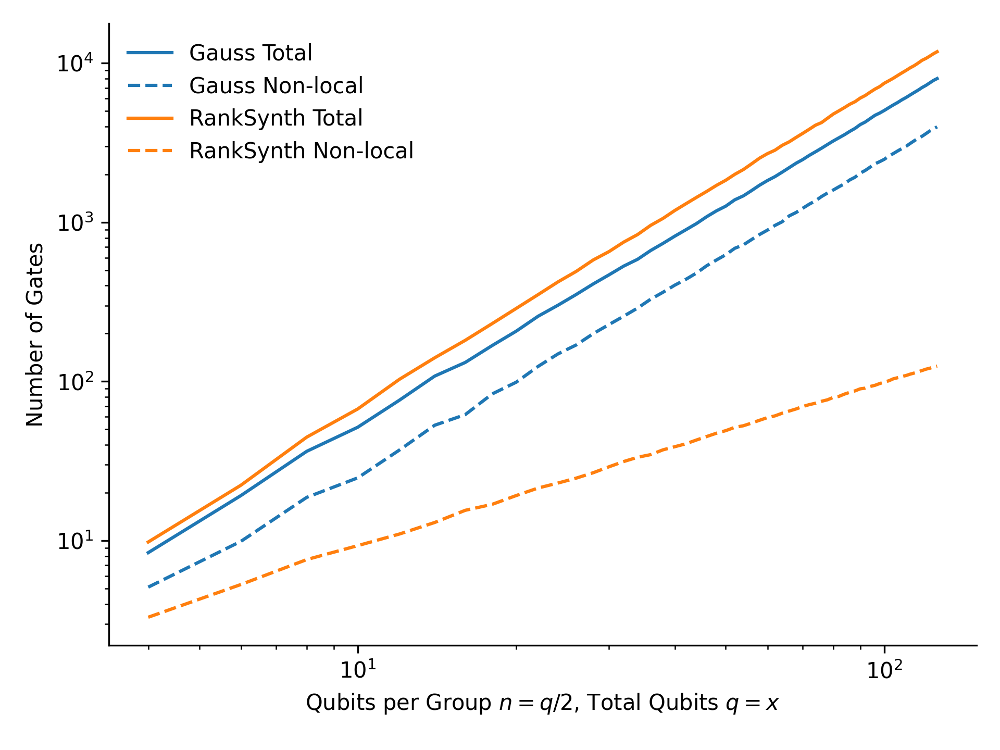
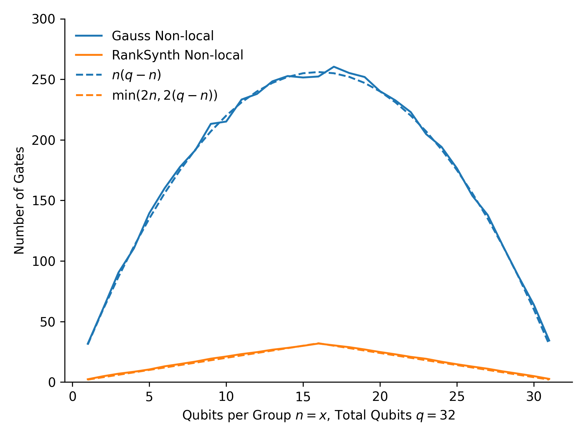

# Synthesizing Controlled or Distributed Clifford Circuits

This repository contains the code accompanying the paper "Synthesizing Controlled or Distributed Clifford Circuits". It presents a self-contained Python implementation with minimal dependencies of two procedures:
1. Controlled CNOT circuit synthesis using the rational canonical form,
2. Distributed CNOT circuit synthesis based on block ULU decomposition and rank factorization. 

In order to facilitate easier integration with existing compilers, there is no dependence on any particular quantum computing libraries - input and output is given simply as a list of tuples representing CNOT or CZ gates. 

### Usage

The only dependencies are `galois` and `numpy`, which you can install with:
```bash
pip install -r requirements.txt
```

The important functions are as follows:
```python
# In src/controlled.py:
def synthesize_controlled_cnot(gates: list[tuple[int, int]]) -> list[tuple[int, int] | tuple[int, int, int]]: ...

# In src/distributed.py:
def synthesize_distributed_cnot(gates: list[tuple[int, int]], n: int) -> list[tuple[int, int]]: ...
```
See the docstrings for more information.

### Cite

If you found this work useful, consider citing the accompanying paper:
```bibtex
@misc{laakkonen2025controlled,
    title = {Synthesizing Controlled or Distributed Clifford Circuits},
    author = {Laakkonen, Tuomas},
    year = 2025,
    url = {https://github.com/tlaakkonen/clifford-synth/raw/refs/heads/main/paper.pdf}
}
```

### References

The rational canonical form implementation follows closely the method of M. Geck based on the work of H.G. Jacob:
> Geck, M., 2020. On Jacob's construction of the rational canonical form of a matrix. The Electronic Journal of Linear Algebra, 36, pp.177-182. [DOI: 10.13001/ela.2020.5055](https://doi.org/10.13001/ela.2020.5055)

An alternative to the ULU decomposition implemented here that may perform slightly better is the more advanced method of F. Serre and M. Püschel:
> Serre, F. and Püschel, M., 2016. Generalizing block LU factorization: A lower–upper–lower block triangular decomposition with minimal off-diagonal ranks. Linear Algebra and its Applications, 509, pp.114-142. [DOI: 10.1016/j.laa.2016.07.020](https://doi.org/10.1016/j.laa.2016.07.020)

### Results

From a log-log plot, you can see the controlled CNOT circuit synthesis uses asymptotically fewer Toffoli gates than the naive strategy of synthesizing with Gaussian elimination and controlling every CNOT gate, although it uses more gates overall:


Similarly, the distributed circuit synthesis where the qubits are grouped into two halves uses asymptotically fewer non-local gates than Gaussian elimination, although it uses more gates overall:


The dependence on the number of qubits in each group is also asymptotically better than the case of Gaussian elimination, which has approximately $ab$ gates between two groups of qubits of size $a$ and $b$:


